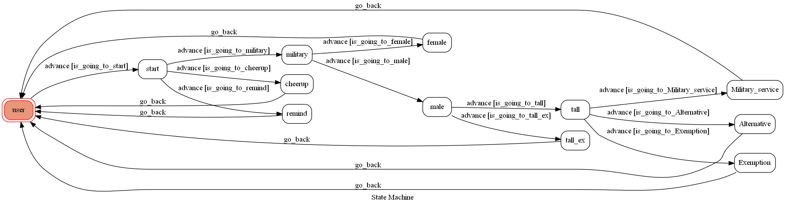

# TOC Project 2020

richard8787 for TOC Project 2020
A Line bot based on a finite state machine

## Featutes
* to check whether do the mandatory military service or not
* take some message to remind you
* cheer you up by sending you some image 

## Finite State Machine

## Usage
The initial state is set to `user`.

* user
	* first to press `start` to use
	* There are two mode
		* military mode
			* press `military` to enter the `military`
			* choose `female` or `male`
			* `female` don't need to do the mandatory military service, and go back to `user`
			* `male` to check the height first
				* if tall is ok enter the `tall` and to check weight
					* the get weight and check the bmi and there three condition `Military_service`, `Alternative`, `Exemption`
						* press the correspond message and go back to `user`
				* if user's height is not to do the mandatory military service, press the message and go bact to `user`
		* remind mode
			* press `remind` to enter the `remind`
			* Reply : random remind message to user
		* cheerup mode
			* press `cheerup` to enter the `cheerup`
			* Reply : random cheerup image to user

